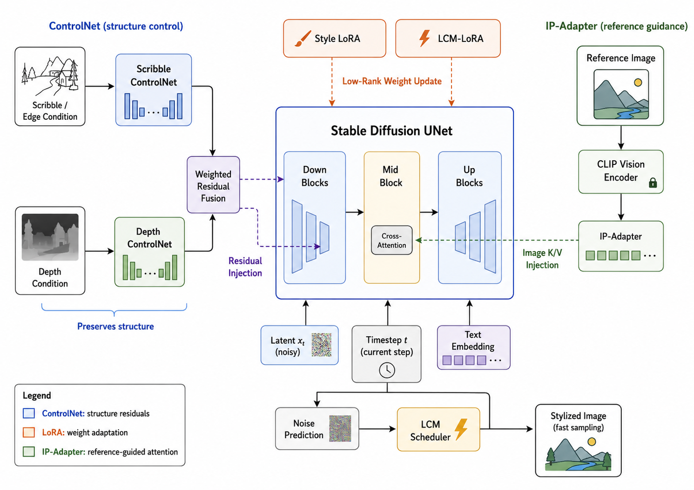
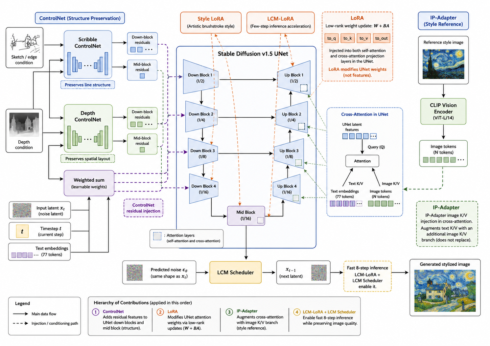
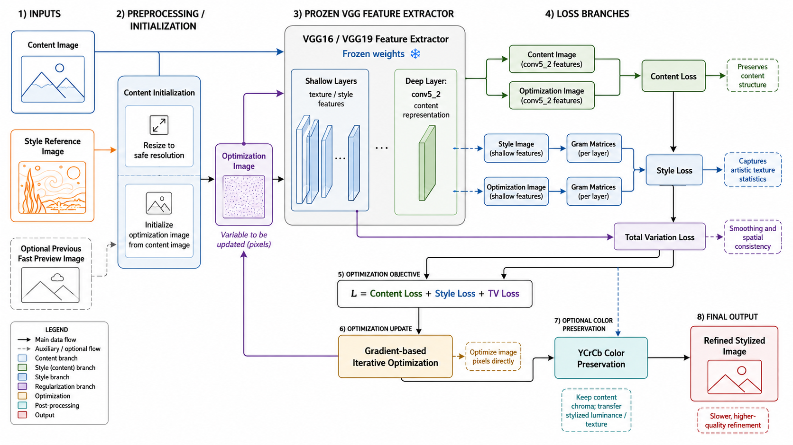

# Draw2Image 🎨

**人机交互技术大作业** - 实时草图/照片艺术风格转换系统

一个基于深度学习的实时图像风格迁移系统，支持草图实时生成艺术画作和照片风格转换。采用 Stable Diffusion + ControlNet + LoRA + IP-Adapter 多模态融合架构，结合经典神经风格迁移算法，提供从速览到精修的完整创作工作流。


---

## ✨ 功能特性

### 🖌️ 实时草图生成
- **WebSocket 实时通信**：笔触即时反馈，毫秒级响应
- **多风格支持**：梵高、莫奈、浮世绘、油画、水彩、赛博朋克等 12+ 种艺术风格
- **LoRA 笔触注入**：加载预训练的艺术大师笔触风格模型
- **IP-Adapter 配色参考**：使用参考图进行智能配色
- **双 ControlNet 控制**：
  - Scribble ControlNet：保持线条结构
  - Depth ControlNet：增强空间深度感

### 📷 照片风格转换
- **自动边缘提取**：从照片中智能提取线条轮廓
- **深度图估算**：基于梯度和亮度的伪深度图生成
- **结构保持**：在风格迁移的同时保留照片主体结构

### 🎭 经典神经风格迁移（精修模式）
- 基于 VGG16/VGG19 的传统 NST 算法
- 高质量迭代优化，适合最终精修输出
- 支持颜色保留、多种池化策略
- 批量处理支持，可配合预设快速生成

---

## 🏗️ 系统架构

```
┌─────────────────────────────────────────────────────────────────┐
│                        前端界面 (index.html)                      │
│    ┌──────────────┐    ┌──────────────┐    ┌──────────────┐     │
│    │   画布绘制    │    │   风格选择    │    │   参数调节    │     │
│    └──────────────┘    └──────────────┘    └──────────────┘     │
└─────────────────────────────────────────────────────────────────┘
                              │ WebSocket
                              ▼
┌─────────────────────────────────────────────────────────────────┐
│                     FastAPI 后端 (main.py)                       │
│    ┌──────────────┐    ┌──────────────┐    ┌──────────────┐     │
│    │  WebSocket   │    │  REST API    │    │  静态资源     │     │
│    │   /ws        │    │  /api/*      │    │  /static     │     │
│    └──────────────┘    └──────────────┘    └──────────────┘     │
└─────────────────────────────────────────────────────────────────┘
                              │
                              ▼
┌─────────────────────────────────────────────────────────────────┐
│                    处理器层 (processor.py)                       │
│  ┌─────────────────────────────────────────────────────────┐    │
│  │                    AIProcessor                           │    │
│  │  ┌───────────┐ ┌───────────┐ ┌───────────┐ ┌──────────┐ │    │
│  │  │ SD v1.5   │ │ControlNet│ │ IP-Adapter│ │  LoRA    │ │    │
│  │  │           │ │ Scribble │ │           │ │ 艺术风格  │ │    │
│  │  │           │ │  Depth   │ │           │ │          │ │    │
│  │  └───────────┘ └───────────┘ └───────────┘ └──────────┘ │    │
│  └─────────────────────────────────────────────────────────┘    │
│  ┌─────────────────────────────────────────────────────────┐    │
│  │               ClassicNSTProcessor                        │    │
│  │  ┌───────────────────────────────────────────────────┐  │    │
│  │  │    Neural-Style-Transfer (VGG16/19)               │  │    │
│  │  └───────────────────────────────────────────────────┘  │    │
│  └─────────────────────────────────────────────────────────┘    │
│  ┌─────────────────────────────────────────────────────────┐    │
│  │                MockProcessor (降级方案)                   │    │
│  │  ┌─────┐ ┌─────┐ ┌─────┐ ┌─────┐ ┌─────┐ ┌─────┐       │    │
│  │  │ 油画 │ │ 素描 │ │ 水彩 │ │ 卡通 │ │ 浮雕 │ │ 铅笔 │       │    │
│  │  └─────┘ └─────┘ └─────┘ └─────┘ └─────┘ └─────┘       │    │
│  └─────────────────────────────────────────────────────────┘    │
└─────────────────────────────────────────────────────────────────┘
```

---

## 🧠 模型完整架构



下图进一步展开了 UNet 各层级中的注入位置，展示 ControlNet residual、LoRA 低秩权重更新和 IP-Adapter Cross-Attention 图像分支之间的协作关系：



本项目的实时生成部分以 **Stable Diffusion v1.5 的 UNet** 作为主生成网络，在其基础上并行引入 **双 ControlNet、Style LoRA、LCM-LoRA 和 IP-Adapter**。这些模块并不是简单串联，而是分别从结构约束、权重适配、参考图引导和采样加速四个层面协同控制生成过程。

### 1. Stable Diffusion UNet 主干

实时模式的核心管线由 `StableDiffusionControlNetPipeline` 构建，基础模型为 `runwayml/stable-diffusion-v1-5`。在每一步扩散采样中，UNet 接收当前噪声 latent `x_t`、时间步 `timestep` 和文本 Prompt embedding，经过 Down Blocks、Mid Block 和 Up Blocks 后预测噪声，再由 LCM Scheduler 更新得到下一步 latent。

UNet 本身负责图像生成的主体能力，其他模块都围绕它进行条件注入：

- **ControlNet** 向 UNet 的 Down Blocks 和 Mid Block 注入结构残差；
- **LoRA** 以低秩权重增量的方式改变 UNet 的注意力/线性层；
- **IP-Adapter** 在 UNet 的 Cross-Attention 中注入参考图特征；
- **LCM Scheduler** 配合 LCM-LoRA 将采样过程压缩到少步数推理。

### 2. 双 ControlNet 的结构协作

代码中同时加载了两个 ControlNet：

```python
self.controlnet_scribble = ControlNetModel.from_pretrained(
    "lllyasviel/sd-controlnet-scribble", torch_dtype=self.dtype
)
self.controlnet_depth = ControlNetModel.from_pretrained(
    "lllyasviel/sd-controlnet-depth", torch_dtype=self.dtype
)

self.pipe = StableDiffusionControlNetPipeline.from_pretrained(
    "runwayml/stable-diffusion-v1-5",
    controlnet=[self.controlnet_scribble, self.controlnet_depth],
    image_encoder=self.image_encoder,
    torch_dtype=self.dtype,
    safety_checker=None
)
```

两个 ControlNet 在每个扩散步中与主 UNet 接收相同的 `x_t`、`timestep` 和文本条件，但它们的图像条件不同：

- **Scribble ControlNet** 接收草图线稿或照片边缘图，负责保持轮廓、布局和主要线条结构；
- **Depth ControlNet** 接收深度图，负责补充空间层次和前后关系；在草图模式下深度图为黑色占位图，在照片模式下由 OpenCV 估算得到。

照片模式下，系统先对原图进行预处理：

- 使用 Canny 边缘检测得到线稿，作为 Scribble ControlNet 的输入；
- 使用 Sobel 梯度和亮度信息估算伪深度图，作为 Depth ControlNet 的输入。

两个 ControlNet 输出的 Down Block residuals 和 Mid Block residual 会按照权重加和后注入主 UNet：

```python
controlnet_conditioning_scale=[c_scale, d_scale]
```

其中 `c_scale` 控制线稿结构约束强度，`d_scale` 控制深度约束强度。项目中的 `strength` 参数会动态影响这两个值：照片模式下结构权重更高，深度权重约为结构权重的一半；草图模式下以线稿控制为主，深度只提供较弱辅助。

### 3. LoRA 的权重注入

项目中使用了两类 LoRA：

- **LCM-LoRA**：用于让 Stable Diffusion v1.5 适配少步数快速采样；
- **Style LoRA**：用于注入特定艺术风格的笔触，例如梵高、莫奈、浮世绘和厚涂油画。

LoRA 的作用位置主要是 UNet 中的注意力投影层和线性层，尤其是 Self-Attention 与 Cross-Attention 中的 `to_q`、`to_k`、`to_v` 和 `to_out` 等权重。它不会替换原模型权重，而是在原权重旁边增加低秩增量：

```text
W' = W + scale · B · A
```

代码中 LCM-LoRA 启动时加载一次，风格 LoRA 根据用户选择动态切换：

```python
self.pipe.load_lora_weights(
    "latent-consistency/lcm-lora-sdv1-5",
    adapter_name="lcm"
)

self.pipe.load_lora_weights(
    lora_path,
    adapter_name=self.lora_adapter_name
)

self.pipe.set_adapters(
    ["lcm", self.lora_adapter_name],
    adapter_weights=[1.0, l_scale]
)
```

因此，LCM-LoRA 主要服务于推理速度，Style LoRA 主要服务于笔触和画风。两者可以同时作用在 UNet 上，最终表现为对主模型权重的联合低秩适配。

### 4. IP-Adapter 的参考图引导

IP-Adapter 用于把用户选择的风格参考图注入到生成过程中。参考图首先经过 CLIP Vision Encoder 提取图像语义特征，再由 IP-Adapter 转换为可被 UNet Cross-Attention 使用的图像 token。

普通 Stable Diffusion 的 Cross-Attention 只使用文本条件：

```text
Query: UNet latent feature
Key / Value: Text embedding
```

加入 IP-Adapter 后，Cross-Attention 中会额外拥有一条图像条件分支：

```text
Query: UNet latent feature
Text Key / Value: Prompt embedding
Image Key / Value: Reference image embedding
```

也就是说，IP-Adapter 不直接修改 UNet 权重，也不产生 ControlNet 那样的残差信号，而是在 Cross-Attention 中提供参考图的 Image K/V 分支，用来控制配色、材质和整体风格倾向。项目中通过以下代码控制其影响强度：

```python
self.pipe.set_ip_adapter_scale(i_scale)
```

当当前风格有对应 LoRA 时，IP-Adapter 主要作为配色辅助；当当前风格没有 LoRA 时，IP-Adapter 会承担更主要的风格参考作用。

### 5. LCM 快速采样机制

为了满足实时交互需求，项目使用 LCM-LoRA 和 `LCMScheduler` 替换默认扩散采样流程：

```python
self.pipe.scheduler = LCMScheduler.from_config(self.pipe.scheduler.config)
```

推理时采样步数设置为 8：

```python
num_inference_steps=8
guidance_scale=3.5
```

这样可以在保持可接受生成质量的同时，大幅降低每次 WebSocket 请求的等待时间，使画布绘制后的实时预览成为可能。

### 6. 精修模式：经典 VGG 神经风格迁移

除实时扩散生成外，项目还保留了一个高质量精修分支 `ClassicNSTProcessor`。该分支对应前端 `/static/refined.html` 和后端 `/api/render_refined`，调用 `Neural-Style-Transfer/INetwork.py` 完成经典神经风格迁移。它不再使用扩散采样生成图像，而是把输出图像本身作为可优化变量，通过 VGG16/VGG19 提取特征并反向传播更新像素。



该分支的完整流程如下：

1. **输入内容图和风格参考图**

   内容图来自用户绘制的草图、上传照片，或实时模式得到的预览结果；风格图来自 `assets/styles/` 中的艺术参考图。前端会把画布图像编码为 Base64，并随风格名、参考图文件名、池化类型和保色开关一起发送到 `/api/render_refined`。

2. **预处理与内容初始化**

   后端首先将 Base64 图像解码为 OpenCV 图像，并进行显存保护缩放。精修模式默认将长边限制在 512 像素以内，并调整到 32 的倍数，避免 VGG 前向和反向传播时显存过高。

   与从随机噪声开始优化不同，本项目使用 **content initialization**：把内容图本身作为优化图像的初始值。这样可以减少噪点，使最终结果更稳定，也更容易保留原始结构。

3. **冻结 VGG 特征提取器**

   VGG16/VGG19 在该流程中只作为冻结的特征提取网络使用，模型权重不参与训练。内容图、风格图和当前优化图像都会经过 VGG，得到不同层级的卷积特征。

   其中浅层卷积特征主要描述边缘、纹理、颜色分布等局部风格信息；深层卷积特征具有更强的语义和结构表达能力。项目默认使用 `conv5_2` 作为内容层，用来约束生成图像保持内容图的主体布局。

4. **内容损失约束结构**

   内容损失比较内容图和优化图像在 `conv5_2` 层的特征差异：

   ```text
   Content Loss = distance(
       VGG(content image, conv5_2),
       VGG(optimization image, conv5_2)
   )
   ```

   这一项的作用是防止风格纹理完全覆盖原始图像，使输出仍然保留人物、建筑、山水等主要结构。

5. **风格损失迁移纹理**

   风格损失使用 VGG 多个浅层和中层特征，并通过 Gram Matrix 表达风格统计信息。Gram Matrix 描述不同通道特征之间的相关性，因此能够捕捉笔触、纹理、色彩分布和局部图案，而不强制保留风格图的具体内容布局。

   流程上，系统分别计算风格图和当前优化图像的 Gram Matrix，然后最小化它们之间的差异：

   ```text
   Style Loss = distance(
       Gram(VGG(style image)),
       Gram(VGG(optimization image))
   )
   ```

   这一项负责把参考图中的艺术纹理迁移到内容图上。

6. **总变差正则化平滑图像**

   除内容损失和风格损失外，项目还加入 Total Variation Loss。它约束相邻像素之间的变化，减少孤立噪点和破碎纹理，使最终图像更加连续、自然。

   项目中的默认配置为：

   ```text
   content_weight = 1.0
   style_weight = 0.025 / 0.05
   tv_weight = 1e-4
   content_layer = conv5_2
   init_image = content
   model = vgg16
   pool_type = max / ave
   ```

7. **梯度迭代优化**

   精修模式的优化目标可以概括为：

   ```text
   L = Content Loss + Style Loss + TV Loss
   ```

   与 Stable Diffusion 直接预测噪声不同，NST 分支直接对输出图像像素进行迭代优化。每次迭代都会重新通过 VGG 提取优化图像的特征，计算损失并反向更新图像，直到达到指定迭代次数。

8. **可选颜色保留后处理**

   当开启 `preserve_color` 时，项目会在 VGG 优化完成后执行 YCrCb 色彩空间后处理。具体做法是保留内容图的 Cr/Cb 色度通道，同时使用风格化结果的 Y 亮度通道，从而实现“保留原图颜色，只迁移风格纹理”的效果。

   这一步适合照片风格迁移场景，可以避免风格图颜色过强导致主体颜色完全失真。

精修模式适合在实时预览后生成更稳定的最终结果，支持：

- `conv5_2` 内容层；
- Max / Average Pooling 切换；
- 风格权重调节；
- YCrCb 色彩空间的颜色保留后处理。

整体上，实时模式负责快速探索和交互反馈，VGG 精修模式负责慢速、高质量、可控的最终输出。

### 7. 模块分工总结

| 模块 | 注入位置 | 作用 |
|------|----------|------|
| Stable Diffusion UNet | 主生成网络 | 根据 latent、时间步和条件信息预测噪声 |
| Scribble ControlNet | UNet Down Blocks / Mid Block residual | 约束线稿、边缘和主体布局 |
| Depth ControlNet | UNet Down Blocks / Mid Block residual | 约束空间深度和层次关系 |
| Style LoRA | UNet 注意力/线性层权重 | 注入艺术笔触和目标画风 |
| LCM-LoRA | UNet 权重适配 | 适配少步数快速采样 |
| IP-Adapter | UNet Cross-Attention | 注入参考图 Image K/V，引导配色和风格 |
| LCM Scheduler | 采样器 | 将扩散过程压缩为 8 步快速推理 |
| Classic NST | VGG16/VGG19 特征优化 | 用于高质量精修输出 |

一句话概括：**ControlNet 管结构，LoRA 管笔触和采样适配，IP-Adapter 管参考图风格引导，Stable Diffusion UNet 负责最终生成，Classic NST 负责慢速精修。**

---

## 📁 项目结构

```
Draw2Image/
├── main.py                 # FastAPI 主入口，WebSocket 服务
├── processor.py            # 核心处理器（AI/NST/Mock）
├── batch_nst.py            # 批量神经风格迁移脚本
├── environment.yml         # Conda 环境配置
├── README.md               # 项目文档
│
├── static/                 # 前端静态资源
│   ├── index.html          # 实时草图生成界面
│   └── refined.html        # 精修模式界面
│
├── docs/                   # 文档插图
│   ├── model_architecture.png          # 模型完整架构图
│   ├── model_architecture_detailed.png # 模型详细注入位置图
│   └── vgg_nst_refinement.png          # VGG 精修分支架构图
│
├── assets/                 # 风格素材库
│   └── styles/             # 风格参考图片
│       ├── vangogh/        # 梵高风格
│       ├── monet/          # 莫奈风格
│       ├── oil/            # 油画风格
│       ├── sculpture/      # 雕塑风格
│       ├── 浮世绘/          # 浮世绘风格
│       ├── 中国水墨/        # 中国水墨风格
│       ├── 赛博朋克/        # 赛博朋克风格
│       ├── 巴洛克/          # 巴洛克风格
│       ├── 文艺复兴/        # 文艺复兴风格
│       ├── 立体主义/        # 立体主义风格
│       ├── 超现实主义/      # 超现实主义风格
│       └── 平面插画/        # 平面插画风格
│
├── models/                 # 预训练模型
│   └── loras/              # LoRA 模型文件
│       ├── vg.safetensors                      # 梵高风格 LoRA
│       ├── monet_v2-000004.safetensors         # 莫奈风格 LoRA
│       ├── Ukiyo-e.safetensors                 # 浮世绘风格 LoRA
│       └── ImpastoBrush LoRa v1.0.1.safetensors # 厚涂油画 LoRA
│
├── Neural-Style-Transfer/  # 经典 NST 模块
│   ├── INetwork.py         # 改进版 NST 算法
│   ├── utils.py            # 工具函数
│   ├── Guide.md            # 参数调优指南
│   ├── README.md           # NST 模块文档
│   └── images/             # 示例图片
│
├── input/                  # 批量处理输入目录
├── ref/                    # 批量处理风格参考目录
└── output/                 # 批量处理输出目录
```

---

## 🚀 快速开始

### 环境要求

- **Python** 3.8+
- **CUDA** 11.7+ (推荐 GPU 运行)
- **显存** ≥ 8GB (推荐 12GB+)
- **Conda** (推荐使用 Anaconda/Miniconda)

### 安装步骤

1. **克隆项目**
```bash
git clone https://github.com/nekoneko2333/Draw2Image.git
cd Draw2Image
```

2. **创建 Conda 环境**
```bash
conda env create -f environment.yml
conda activate base  # 或您的环境名
```

3. **安装核心依赖**
```bash
pip install fastapi uvicorn websockets
pip install torch torchvision --index-url https://download.pytorch.org/whl/cu118
pip install diffusers transformers accelerate
pip install opencv-python pillow numpy
```

4. **下载预训练模型**

模型会在首次运行时自动从 HuggingFace 下载：
- `runwayml/stable-diffusion-v1-5`
- `lllyasviel/sd-controlnet-scribble`
- `lllyasviel/sd-controlnet-depth`
- `h94/IP-Adapter`
- `latent-consistency/lcm-lora-sdv1-5`

> 💡 **提示**: 中国大陆用户建议配置 HuggingFace 镜像：
> ```python
> os.environ["HF_ENDPOINT"] = "https://hf-mirror.com"
> ```

5. **启动服务**
```bash
python main.py
```

6. **访问界面**

打开浏览器访问 `http://localhost:8000/static/index.html`

---

## 📖 使用指南

### 实时草图模式

1. 在左侧画布上绘制草图
2. 从右侧面板选择艺术风格
3. 可选择具体的风格参考图
4. 调节「结构保留」滑块控制风格强度
5. 在 Prompt 输入框描述画面内容（支持中文）
6. 实时查看右侧生成结果

### 照片转换模式

1. 点击「上传照片」按钮
2. 系统自动提取边缘和深度信息
3. 选择目标艺术风格
4. 调整参数后自动生成

### 精修模式

访问 `/static/refined.html` 使用经典 NST 算法进行高质量精修：
- 更长的迭代时间换取更精细的效果
- 支持颜色保留选项
- 支持不同池化策略（Max/Average）

### 批量处理

```bash
# 基础用法
python batch_nst.py

# 使用预设模式
python batch_nst.py --preset balanced  # fast/balanced/quality/ultra

# 自定义参数
python batch_nst.py --num_iter 200 --style_weight 0.05 --image_size 768

# 筛选特定文件
python batch_nst.py --content "cat" --style "monet" --limit 10
```

**预设模式说明**：

| 预设 | 迭代次数 | 图像尺寸 | 预计耗时 | 适用场景 |
|------|----------|----------|----------|----------|
| fast | 50 | 400px | 1-2 分钟 | 快速预览 |
| balanced | 100 | 512px | 3-5 分钟 | 日常使用 |
| quality | 200 | 768px | 8-15 分钟 | 高质量输出 |
| ultra | 500 | 1024px | 20-40 分钟 | 极致品质 |

---

## 🎨 支持的艺术风格

### LoRA 风格（真实笔触）

| 风格 | 触发词 | 说明 |
|------|--------|------|
| 梵高 (vangogh) | `vg` | 厚重的后印象派笔触，漩涡纹理 |
| 莫奈 (monet) | `painting (medium)` | 印象派光影，梦幻氛围 |
| 油画 (oil) | `impasto` | 经典厚涂技法，丰富纹理 |
| 浮世绘 | `ukiyo-e` | 日本木版画，平面色块 |

### 纯 IP-Adapter 风格

| 风格 | 特点 |
|------|------|
| 水彩 (watercolor) | 湿染技法，透明层次 |
| 雕塑 (sculpture) | 大理石质感，古典光影 |
| 赛博朋克 | 霓虹光效，未来科幻 |
| 中国水墨 | 传统笔墨，留白意境 |
| 巴洛克 | 华丽装饰，戏剧光影 |
| 文艺复兴 | 古典构图，细腻写实 |
| 立体主义 | 几何分割，多视角 |
| 超现实主义 | 梦境奇幻，超越现实 |
| 平面插画 | 现代设计，扁平风格 |

---

## ⚙️ API 接口

### WebSocket 实时生成

**端点**: `ws://localhost:8000/ws`

**请求格式**:
```json
{
  "image": "data:image/png;base64,...",
  "style": "vangogh",
  "prompt": "一只可爱的猫",
  "strength": 0.6,
  "ref_image_name": "starry_night.jpg",
  "is_photo_mode": false
}
```

**响应格式**:
```json
{
  "type": "result",
  "image": "data:image/jpeg;base64,...",
  "depth": "data:image/jpeg;base64,..."
}
```

### REST API

**获取素材结构**:
```
GET /api/assets
```

**精修渲染**:
```
POST /api/render_refined
Content-Type: application/json

{
  "image": "base64...",
  "style": "vangogh",
  "ref_image_name": "reference.jpg",
  "preserve_color": false,
  "pool_type": "max",
  "style_weight": 0.05
}
```

---

## 🔧 参数说明

### 处理器参数

| 参数 | 类型 | 默认值 | 说明 |
|------|------|--------|------|
| `strength` | float | 0.6 | 结构保留程度 (0.0-1.0)，越高保留越多原始结构 |
| `style` | string | "vangogh" | 目标风格名称 |
| `prompt` | string | "" | 画面描述（支持中文自动翻译） |
| `ref_image_name` | string | null | 指定的参考图文件名 |
| `is_photo_mode` | bool | false | 是否为照片模式 |

### NST 批量处理参数

| 参数 | 默认值 | 说明 |
|------|--------|------|
| `--num_iter` | 100 | 优化迭代次数 |
| `--image_size` | 512 | 输出图像最大边长 |
| `--content_weight` | 1.0 | 内容损失权重 |
| `--style_weight` | 0.05 | 风格损失权重 |
| `--content_layer` | conv5_2 | 内容特征提取层 |
| `--pool_type` | max | 池化类型 (max/ave) |
| `--preserve_color` | false | 保留原图颜色 |
| `--tv_weight` | 8.5e-5 | 总变差正则化权重 |

---

## 🛠️ 技术栈

### 核心框架
- **FastAPI** - 高性能异步 Web 框架
- **PyTorch** - 深度学习框架
- **Diffusers** - Stable Diffusion 推理库

### AI 模型
- **Stable Diffusion v1.5** - 基础生成模型
- **ControlNet** - 条件控制网络
- **IP-Adapter** - 图像提示适配器
- **LCM-LoRA** - 快速推理加速
- **VGG16/19** - 特征提取网络

### 图像处理
- **OpenCV** - 图像处理
- **PIL/Pillow** - 图像 I/O
- **NumPy** - 数值计算

---

## 📊 性能优化

### GPU 内存管理
- 动态图像缩放保护 (最大 512px)
- LoRA 热切换，避免重复加载
- 显存自动回收 (`torch.cuda.empty_cache()`)

### 推理加速
- LCM-LoRA 8 步快速推理
- FP16 混合精度计算
- 条件编译的 ControlNet 权重

### 资源预加载
- 启动时扫描并缓存所有风格素材
- PIL Image 预转换为 GPU 可用格式

---

## 🐛 常见问题

### Q: 显存不足怎么办？

A: 尝试以下方案：
1. 降低输入图像尺寸
2. 使用 MockProcessor 降级方案
3. 减少 ControlNet 权重
4. 关闭照片模式的深度图

### Q: 生成速度慢？

A: 确保：
1. 使用 GPU 运行
2. LCM-LoRA 正确加载
3. 推理步数设为 8（已默认）

### Q: 中文 Prompt 不生效？

A: 系统内置简单中英词表翻译，复杂描述建议直接使用英文。

### Q: 风格效果不明显？

A: 调整 `strength` 参数（降低值可增强风格），或选择有 LoRA 支持的风格。

---

## 📝 更新日志

### v1.2.0
- ✨ 新增照片模式自动边缘提取
- ✨ 新增深度图估算和预览
- 🎨 增加多种中文风格支持
- ⚡ 优化 LoRA 热切换性能

### v1.1.0
- ✨ 集成 IP-Adapter 配色参考
- ✨ 支持双 ControlNet
- 🔧 批量处理脚本增强

### v1.0.0
- 🎉 初始版本发布
- ✨ 实时 WebSocket 草图生成
- ✨ 经典 NST 精修模式

---

## 📄 许可证

本项目采用 MIT 许可证 - 详见 [LICENSE](LICENSE) 文件

Neural-Style-Transfer 模块基于 [titu1994/Neural-Style-Transfer](https://github.com/titu1994/Neural-Style-Transfer)

---

## 🙏 致谢

- [Stable Diffusion](https://github.com/CompVis/stable-diffusion)
- [ControlNet](https://github.com/lllyasviel/ControlNet)
- [IP-Adapter](https://github.com/tencent-ailab/IP-Adapter)
- [LCM-LoRA](https://github.com/luosiallen/latent-consistency-model)
- [Neural-Style-Transfer](https://github.com/titu1994/Neural-Style-Transfer)

---

<p align="center">
  Made with ❤️ for 人机交互技术课程
</p>
